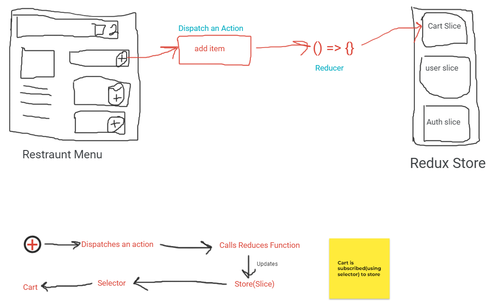

> Two layers that work together in a sync over the browser
  - UI layer - View, what we see on webpage, JSX Code powers the UI layer
  - Data layer - All things that we do, passing data from one component to another, props, state, context 
 
> Redux is required to manage the data layer & handle the data
  - Context was used to provide prop drilling
  - Any component in the app can access/modify the context
  - When application grows, libraries like redux come into picture
  - context can be used to manage themes, light or dark
  - To manage data properly, we can use redux

> Why do we use Redux?
  - Used for data management
  - Proper way of managing, modifying, reading & accessing the data
  - ngrx, Mobex are such alternatives

> Cons of Redux?
  - Complex setup
  - Huge learning curve
  - complicated
  - lot's of copy, paste

> Difference between redux & redux-toolkit(RTK)
 - RTK is intended to be the standard way to write Redux logic. It was created to address the common concerns of Redux
    - Configuring a store is too complicated
    - A lot of packages were to be added to do anything useful
    - Lot's of boilerplate code

> Should we have multiple stores in our app?
 - No, we will have one store for our app
 - A whole large store with a lot of data
 - Logical seperation of our Store(Slices)
 - Each store will have different slices

> Slice is a small portion of our redux store

> What all slice can our app have?
   - Authentication slice
   - theme slice
   - cart slice
   - user slice

> We cannot directly modify the store on a button click

> button on click dispatches an action, which calls the reducer function which updates the slice of the redux store

> selector: used to select slice/portion out of store
   - hook
   - using selector means subscribing to the store

+ -> dispaches(action) -> reducer fn -> updates store(slice) -> selector -> UI

> install
  - @reduxjs/toolit
  - react-redux -> bridge between redux & react

> reducers export by default.
> actions export by name as there can be multiple actions for a slice.

> useSelector is used to subscribe to the store. 

